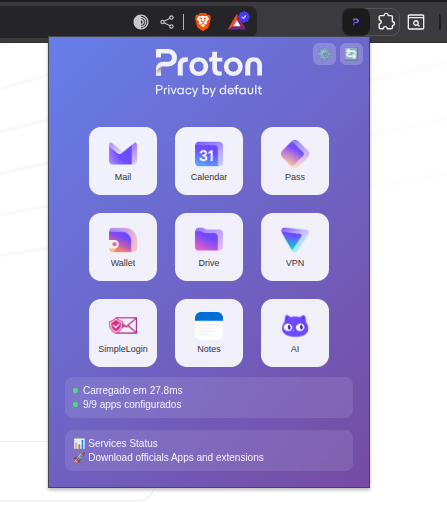

= Proton Launcher Extension

Uma extensão para Chrome/Brave/Chromium que permite lançar rapidamente WebApps Proton a partir de um grid personalizável, com status de conexão e atalhos.

[IMPORTANT]
====
Não afiliado ao Proton AG. 
 
Esta extensão é um projeto independente, sem vínculos com a Proton AG ou seus produtos oficiais.  

Esta extensão é para o acesso a serviços Proton, somente um popup com os links para os serviços Proton.  

Pode ser usada como modelo para criar uma extensão personalizada para acessar qualquer outro serviço web.  

====

== Funcionalidades

- Grid 3x3 personalizável - URLs no json
- Possibilidade de adicionar ícones, categorias e descrições para cada link
- Status de conexão (online/offline) e quantidade de apps configurados
- Temas visuais customizáveis
- Links rápidos para status dos serviços e download de apps oficiais
- Configurações salvas via `chrome.storage.sync`
- Atalho de teclado (Ctrl+Shift+L) para abrir o launcher
- Suporte a múltiplos navegadores baseados em Chromium

== Instalação

. Baixe ou clone este repositório.
. No Chrome/Brave, acesse `chrome://extensions/` e ative o modo de desenvolvedor.
. Clique em "Carregar sem compactação" e selecione a pasta do projeto.

== Estrutura do Projeto

- `popup/` – Interface do launcher (HTML, CSS, JS)
- `config/` – Arquivos de configuração padrão (`apps.json`, `settings.json`)
- `storage/` – Gerenciamento de armazenamento do usuário
- `background/` – Service worker para eventos e integrações
- `assets/` – Ícones e logo

== Configuração

Edite os arquivos em `config/` para personalizar os apps e preferências padrão. As configurações do usuário são salvas automaticamente.

== Atalhos

- `Ctrl+Shift+L` – Abre o launcher rapidamente

